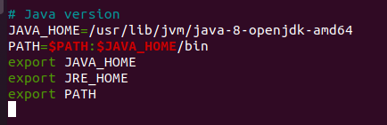

# Instalación de JDK en Ubuntu 20.04
## 1. ¿Qué es el JDK y para que se usa?
* El JDK o muy bien lo que significan sus siglas: Java Development Kit es un software que nos permite crear programa en base a su lenguaje Java. Se usa mayormente para crear programas como anteriormente comentado, juegos y aplicaciones para móviles.
## 2. ¿Cómo instalar JDK en nuestro SO Ubuntu?
* Primeramente lo que vamos hacer es actualizar los repositorios del sistema con el siguiente comando:
```
$ sudo apt-get update
```
* En mi caso ya estoy como administrador por lo tanto solo tendría que usar el comando de esta manera:
```
$ apt-get update
```

* Seguidamente de haberse actualizado, instalaremos OpenJDK, se trata de una versión open source y gratuita a diferencia del JDK de Oracle que es privativo. La versión que yo voy a instalar es la 8, pero dependiendo de la versión que quieras instalar donde se encuentra el número en el comando puede ser cambiado por la deseada.
```
$ sudo apt install openjdk-8-jdk
```
* En mi caso como ya me encuentro como administrador colocaré el comando de la siguiente forma:

```
$ apt install openjdk-8-jdk
```

* Nos pedirá confirmar la instalación y lo haremos ingresando la `s`


* Para confirmar que se ha instalado la versión que hemos especificado de java utilizaremos el siguiente comando:

```
$ java -version
```

## Configurar las variables de entorno
* Para poder configurar este parámetro tendremos que confirmar que se haya instalado java en nuestras librerías, para ello utilizamos este comando:
```
$ ls /usr/lib/jvm
```
* Para poder comprender que es lo que estamos haciendo con este tipo de comando `ls` lista los archivos dentro de la dirección que estemos especificanto, en nuestro cado la dirección o ruta es `/usr/lib/jvm`, por lo que estamos diciendo que nos liste los archivos que se encuentran dentro del directorio usuario/librerias/maquina-virtual-java que es donde se archivan los datos del programa Java.


* Una vez sepamos estos datos, utilizaremos la ruta de `/usr/lib/jvm/java-8-openjdk-amd64` que es donde se ubica Java instalado.
* Tendremos que editar el fichero /etc/profile con el editor de ficheros `nano` donde ahí se encuentran las variables de entorno del sistema.
```
$ sudo nano /etc/profile
```
* Nuevamente comento que al estar como administrador el comando lo utilizaré sin el `sudo` que es quien nos da el poder de hace cambios importantes de administrador.
* Al entrar al fichero encontraremos varias variables especificadas por lo que nos moveremos al final del mismo y añadiremos las siguientes líneas:

```
 # Java version
JAVA_HOME=/usr/lib/jvm/java-8-openjdk-amd64 -- Donde esta era la ruta anterior que comentamos que recordásemos
PATH=$PATH:$JAVA_HOME/bin
export JAVA_HOME
export JRE_HOME
export PATH
```



* Una vez escrito las líneas le daremos `ctrl` + `x` para guardar los cambios en el fichero. Nos preguntará si queremos guardarlo y le daremos a la `s`.


* Para comprobar que esto ha funcionado, utilizaremos el siguiente comando para leer el fichero que acabamos de editar para ver que todo siga en orden:
```
$ cat /etc/profile
```
* Una vez este todo perfecto comprobamos que la variable que hemos utilizado haga de referencia a la ruta donde tenemos instalado el Java
